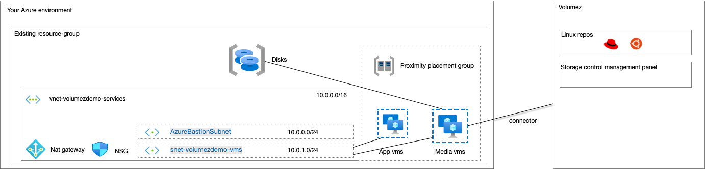
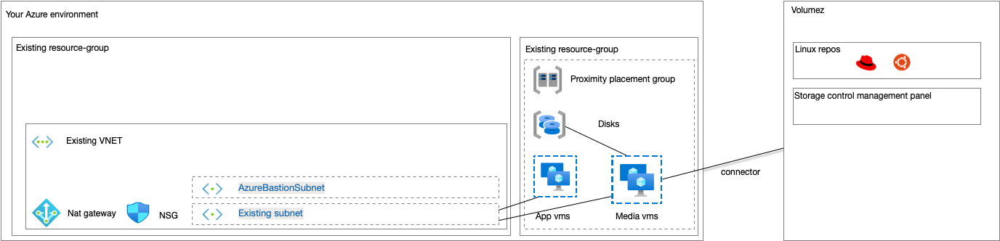

# Deploy Volumez demo to Azure

This repo demonstrates 2 deployment scenarios for your volumez environment on Azure:
- Simple resourcegroup deployment with pre configured network and vms
- Customized resourcegroup deployment where you can choose your vm size and choose an existing vnet and subnet.

This demo uses Bicep modules from the [Azure Verified Modules](https://github.com/Azure/bicep-registry-modules) github repo.

**Pre requisites**
- an Account with volumez; you need this to get your Tenant token
- a valid Azure subscription
- a valid user account/ service principal for your Azure subscription  with contributor permissions on the existing resourcegroups

## Simple resourcegroup deployment

This is ideal if you simply like to get started with default parameters. Just select an existing resourcegroup, define a password and the amount of application VMS and media vms. The tenant_token parameter is needed for communication with the Volumez backend, you can find this information in your volumez Account panel under developer info.
If you like to login to your VM, use the Bastion to connect; the default username is: volumezdemoUser.



[](https://portal.azure.com/#blade/Microsoft_Azure_CreateUIDef/CustomDeploymentBlade/uri/https%3A%2F%2Fraw.githubusercontent.com%2Fchrisvugrinec%2Fvolumezdemo%2Fmaster%2F%2Fazuredeploy.json/uiFormDefinitionUri/https%3A%2F%2Fraw.githubusercontent.com%2Fchrisvugrinec%2Fvolumezdemo%2Fmaster%2Fportal-uidefinitions%2FuiDefinition.json)


## Customized resourcegroup deployment

If you like to have more control of the deployment, use this to get started yourself. This is ideal as a starter for people with an **existing** environment; where you like to have the VMS in a seperate resource group, customize the size of your VMS and use an **existing** Virtual network.  The tenant_token parameter is needed for communication with the Volumez backend, you can find this information in your volumez Account panel under developer info.

If you like to login to your VM, use the Bastion to connect; the default username is: volumezdemoUser

Please note that the creation of a new Resource Group or New Virtual Network is **NOT** supported in this scenario.


[](https://portal.azure.com/#blade/Microsoft_Azure_CreateUIDef/CustomDeploymentBlade/uri/https%3A%2F%2Fraw.githubusercontent.com%2Fchrisvugrinec%2Fvolumezdemo%2Fmaster%2F%2Fazuredeploy-custom.json/uiFormDefinitionUri/https%3A%2F%2Fraw.githubusercontent.com%2Fchrisvugrinec%2Fvolumezdemo%2Fmaster%2Fportal-uidefinitions%2FuiDefinition-custom.json)

## Customization instructions

### With Azure ARM template

You can convert the bicep code here into arm code with this command:

```
az bicep build --file demo.bicep --outfile azuredeploy.json
```

You can edit and change the ARM temlate according to your desire and deploy the code using the portal or cli.

### With bicep code

You can also change the bicep code directly and then deploy the bicep code directly: 

```
az deployment group create -g bicep --template-file demo.bicep  -n deploymentName1
```

The uiDefinition files in this repository are customization files that help you with filling in the right parameters in the azure portal. Use [this](https://portal.azure.com/#view/Microsoft_Azure_CreateUIDef/FormSandboxBlade) tool to edit them or develop them yourself.

## Links

| Description | Template |
|---|---|
| Deploy Simple Volumez demo |[](https://portal.azure.com/#blade/Microsoft_Azure_CreateUIDef/CustomDeploymentBlade/uri/https%3A%2F%2Fraw.githubusercontent.com%2Fchrisvugrinec%2Fvolumezdemo%2Fmaster%2F%2Fazuredeploy.json/uiFormDefinitionUri/https%3A%2F%2Fraw.githubusercontent.com%2Fchrisvugrinec%2Fvolumezdemo%2Fmaster%2Fportal-uidefinitions%2FuiDefinition.json)|
| Deploy Customizable Volumez demo |[](https://portal.azure.com/#blade/Microsoft_Azure_CreateUIDef/CustomDeploymentBlade/uri/https%3A%2F%2Fraw.githubusercontent.com%2Fchrisvugrinec%2Fvolumezdemo%2Fmaster%2F%2Fazuredeploy-custom.json/uiFormDefinitionUri/https%3A%2F%2Fraw.githubusercontent.com%2Fchrisvugrinec%2Fvolumezdemo%2Fmaster%2Fportal-uidefinitions%2FuiDefinition-custom.json)|
